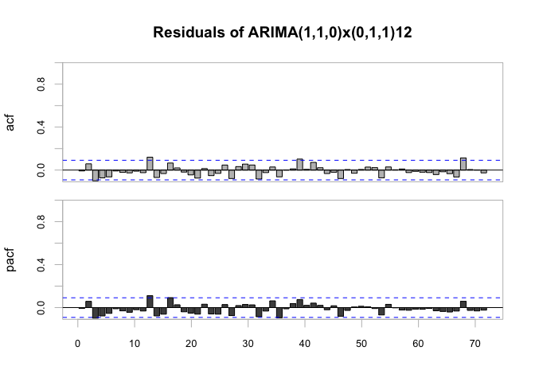

## R Code

``` r
library(TSA)

# Data prep -------

# read data
LE <- read.csv("/Users/Lake_Erie.csv")

# take out the 1st column
LE <- LE[, -1]

# reorder column
LE <- LE[, c(2, 1)]

# convert to a ts object
LE_ts <- ts(
  LE,
  start = c(1921, 1),
  end = c(1970, 12),
  frequency = 12
)
LE_ts <- LE_ts[, -1]

# 80/20 training/testing split ------
train <- window(LE_ts, end = c(1960, 12))
test <- window(LE_ts, start = c(1961, 1))
```

``` r
# Plotting -------

# plot the original with labels
plot(LE_ts,
     main = "Monthly Lake Erie Water Levels (1921-1970)",
     xlab = "",
     ylab = "Water Levels in Tens of Meters")
points(y = LE_ts,
       x = time(LE_ts),
       pch = as.vector(season(LE_ts)))
```


``` r
# plot the training series
plot(train,
     main = "Monthly Lake Erie Water Levels (1921-1960)",
     xlab = "",
     ylab = "Water Levels in Tens of Meters")
```


``` r
# plot the lagged-one differenced series
plot(diff(train),
     main = "Lagged-one Differenced Series (1921-1960)",
     xlab = "",
     ylab = "Water Levels in Tens of Meters")
```


``` r
diff_LE <- diff(train)

# Dickey-Fuller Test -------
library(tseries, quietly = T)
adf.test(diff_LE) # stationary
```

    ## 
    ##  Augmented Dickey-Fuller Test
    ## 
    ## data:  diff_LE
    ## Dickey-Fuller = -13.909, Lag order = 7, p-value = 0.01
    ## alternative hypothesis: stationary

``` r
# ACF & PCF ---------
library(PerformanceAnalytics)
chart.ACFplus(diff_LE, 
              main = "Lagged-one Differenced Series (training)", 
              maxlag = 60)
```


``` r
# Seasonality ---------
library(TSA)
p <- periodogram(diff_LE)
```


``` r
seasonality <- p$freq[which.max(p$spec)] # 1/12
1 / seasonality # 12
```

    ## [1] 12

``` r
# Deterministic trend model ---------
fit <- lm(train ~ season(train) - 1)
fit
```

    ## 
    ## Call:
    ## lm(formula = train ~ season(train) - 1)
    ## 
    ## Coefficients:
    ##   season(train)January   season(train)February      season(train)March  
    ##                  13.95                   13.88                   14.27  
    ##     season(train)April        season(train)May       season(train)June  
    ##                  15.40                   16.03                   16.27  
    ##      season(train)July     season(train)August  season(train)September  
    ##                  16.19                   15.78                   15.20  
    ##   season(train)October   season(train)November   season(train)December  
    ##                  14.58                   14.01                   13.87

``` r
pred <- predict(fit)
chart.ACFplus(train - pred)
```


``` r
# SARIMA -------

# seasonal difference
lagged12_diff_LE <- diff(diff_LE, lag = 12)

# plot
plot(window(lagged12_diff_LE, start = c(1956, 1)),
     ylab = "",
     main = "First and Seasonal Difference of the Series (train)")
points(y = lagged12_diff_LE,
       x = time(lagged12_diff_LE),
       pch = as.vector(season(lagged12_diff_LE)))
```


``` r
# ACF&PACF
chart.ACFplus(lagged12_diff_LE, 
              main = "First and Seasonal Difference of the Series (train)", 
              maxlag = 60)
```


``` r
# Model Fitting ------------

# ARIMA(1,1,0)x(1,1,1)12
arima(train,
      order = c(1, 1, 0),
      seasonal = list(order = c(1, 1, 1), period = 12)) # aic = 552.16
```

    ## 
    ## Call:
    ## arima(x = train, order = c(1, 1, 0), seasonal = list(order = c(1, 1, 1), period = 12))
    ## 
    ## Coefficients:
    ##          ar1     sar1     sma1
    ##       0.2062  -0.0590  -1.0000
    ## s.e.  0.0455   0.0469   0.1481
    ## 
    ## sigma^2 estimated as 0.171:  log likelihood = -273.08,  aic = 552.16

``` r
# ARIMA(1,1,0)x(0,1,1)12 - chosen 1
arima(train,
      order = c(1, 1, 0),
      seasonal = list(order = c(0, 1, 1), period = 12)) # aic = 551.74
```

    ## 
    ## Call:
    ## arima(x = train, order = c(1, 1, 0), seasonal = list(order = c(0, 1, 1), period = 12))
    ## 
    ## Coefficients:
    ##          ar1     sma1
    ##       0.2006  -1.0000
    ## s.e.  0.0453   0.0515
    ## 
    ## sigma^2 estimated as 0.1721:  log likelihood = -273.87,  aic = 551.74

``` r
# ARIMA(1,1,1)x(1,1,1)12
arima(train,
      order = c(1, 1, 1),
      seasonal = list(order = c(1, 1, 1), period = 12)) # aic = 553.87
```

    ## 
    ## Call:
    ## arima(x = train, order = c(1, 1, 1), seasonal = list(order = c(1, 1, 1), period = 12))
    ## 
    ## Coefficients:
    ##          ar1      ma1     sar1     sma1
    ##       0.2821  -0.0784  -0.0596  -1.0000
    ## s.e.  0.1424   0.1436   0.0469   0.1369
    ## 
    ## sigma^2 estimated as 0.1709:  log likelihood = -272.94,  aic = 553.87

``` r
# ARIMA(1,1,1)x(0,1,1)12
arima(train,
      order = c(1, 1, 1),
      seasonal = list(order = c(0, 1, 1), period = 12)) # aic = 553.48
```

    ## 
    ## Call:
    ## arima(x = train, order = c(1, 1, 1), seasonal = list(order = c(0, 1, 1), period = 12))
    ## 
    ## Coefficients:
    ##          ar1      ma1     sma1
    ##       0.2738  -0.0755  -1.0000
    ## s.e.  0.1463   0.1476   0.0509
    ## 
    ## sigma^2 estimated as 0.172:  log likelihood = -273.74,  aic = 553.48

``` r
# ARIMA(3,1,3)x(1,1,1)12 - chosen 2
arima(train,
      order = c(3, 1, 3),
      seasonal = list(order = c(1, 1, 1), period = 12)) # aic = 550.16
```

    ## 
    ## Call:
    ## arima(x = train, order = c(3, 1, 3), seasonal = list(order = c(1, 1, 1), period = 12))
    ## 
    ## Coefficients:
    ##          ar1     ar2      ar3      ma1      ma2     ma3     sar1     sma1
    ##       0.7124  0.0655  -0.1842  -0.5217  -0.1059  0.0172  -0.0743  -1.0000
    ## s.e.  0.6615  0.9312   0.4978   0.6650   0.8205  0.3913   0.0475   0.0823
    ## 
    ## sigma^2 estimated as 0.1665:  log likelihood = -267.08,  aic = 550.16

``` r
# ARIMA(3,1,3)x(0,1,1)12
arima(train,
      order = c(3, 1, 3),
      seasonal = list(order = c(0, 1, 1), period = 12)) # aic = 550.56
```

    ## 
    ## Call:
    ## arima(x = train, order = c(3, 1, 3), seasonal = list(order = c(0, 1, 1), period = 12))
    ## 
    ## Coefficients:
    ##          ar1      ar2      ar3      ma1     ma2      ma3     sma1
    ##       0.8923  -0.1961  -0.0222  -0.7063  0.1202  -0.1074  -1.0000
    ## s.e.  1.2847   1.6688   0.8895   1.2863  1.4310   0.6723   0.0432
    ## 
    ## sigma^2 estimated as 0.168:  log likelihood = -268.28,  aic = 550.56

``` r
# warning - possible convergence problem

# Model selection ----------

# ARIMA(1,1,0)x(0,1,1)12
m1 <-
  arima(train,
        order = c(1, 1, 0),
        seasonal = list(order = c(0, 1, 1), period = 12)) # aic = 645.71

# ARIMA(3,1,3)x(1,1,1)12
m2 <-
  arima(train,
        order = c(3, 1, 3),
        seasonal = list(order = c(1, 1, 1), period = 12)) # aic = 641.17

# Model Diagnostic -------

# m1 - ARIMA(1,1,0)x(0,1,1)12

# calculating residuals
m1.res <- train - fitted(m1, train)

# plotting residuals
plot(m1.res, main = "Residuals of ARIMA(1,1,0)x(0,1,1)12")
```


``` r
# residuals autocorrelations
chart.ACFplus(m1.res, 
              main = "Residuals of ARIMA(1,1,0)x(0,1,1)12", 
              maxlag = 60)
```



``` r
par(mfrow = c(1, 2))

# residual histogram
hist(m1.res, main = "Residuals of ARIMA(1,1,0)x(0,1,1)12")

# reisidual QQ plot
qqnorm(m1.res, main = "Residuals of ARIMA(1,1,0)x(0,1,1)12")
qqline(m1.res, col = 2)
```


``` r
# m2 - ARIMA(3,1,3)x(1,1,1)12

# calculating residuals
m2.res <- train - fitted(m2, train)

par(mfrow = c(1, 1))

# plotting residuals
plot(m2.res, main = "Residuals of ARIMA(3,1,3)x(1,1,1)12")
```


``` r
# residuals autocorrelations
chart.ACFplus(m2.res, 
              main = "Residuals of ARIMA(3,1,3)x(1,1,1)12", 
              maxlag = 60)
```


``` r
par(mfrow = c(1, 2))

# residual histogram
hist(m2.res, main = "Residuals of ARIMA(3,1,3)x(1,1,1)12")

# reisidual QQ plot
qqnorm(m2.res, main = "Residuals of ARIMA(3,1,3)x(1,1,1)12")
qqline(m2.res, col = 2)
```


``` r
par(mfrow = c(1, 1))

# Prediction -------

# m1 - ARIMA(1,1,0)x(0,1,1)12
# m2 - ARIMA(3,1,3)x(1,1,1)12

m1.plot <- plot(
  m1,
  n.ahead = 120,
  n1 = c(1950, 1),
  type = "l",
  main = "Forecast - ARIMA(1,1,0)x(0,1,1)12 "
)
lines(test, col = 12)
```


``` r
m2.plot <- plot(
  m2,
  n.ahead = 120,
  n1 = c(1950, 1),
  type = "l",
  main = "Forecast - ARIMA(3,1,3)x(1,1,1)12"
)
lines(test, col = 12)
```


``` r
# Prediction Comparison Plot
m1pred <- predict(m1, n.ahead = 120)$pred
m2pred <- predict(m2, n.ahead = 120)$pred

plot(
  test,
  type = 'l',
  col = "blue",
  lwd = 2,
  main = "Comparison between Forecast Illustrations",
  ylab = "Water Level in Tens Meter"
)
lines(m1pred, col = "orange", lwd = 3)
lines(m2pred, col = "chocolate", lwd = 3)

legend(
  "bottomright",
  legend = c(
    "Testing dataset",
    "ARIMA(1,1,0)x(0,1,1)12",
    "ARIMA(3,1,3)x(1,1,1)12"
  ),
  col = c("blue", "orange", "chocolate"),
  lwd = c(2, 3, 3)
)
```


``` r
# checking constant mean each cycle in prediction

# m1

for (i in 1961:1970) {
  k <- mean(subset(m1.plot$pred, floor(time(m1.plot$pred)) == i))
  cat("The mean in year", i, "is", k, "\n")
}
```

    ## The mean in year 1961 is 15.19602 
    ## The mean in year 1962 is 15.1792 
    ## The mean in year 1963 is 15.16463 
    ## The mean in year 1964 is 15.15006 
    ## The mean in year 1965 is 15.13549 
    ## The mean in year 1966 is 15.12092 
    ## The mean in year 1967 is 15.10635 
    ## The mean in year 1968 is 15.09178 
    ## The mean in year 1969 is 15.07721 
    ## The mean in year 1970 is 15.06264

``` r
# decreasing mean overtime

# m2

for (i in 1961:1970) {
  k <- mean(subset(m2.plot$pred, floor(time(m2.plot$pred)) == i))
  cat("The mean in year", i, "is", k, "\n")
}
```

    ## The mean in year 1961 is 15.29439 
    ## The mean in year 1962 is 15.36981 
    ## The mean in year 1963 is 15.35586 
    ## The mean in year 1964 is 15.3483 
    ## The mean in year 1965 is 15.34025 
    ## The mean in year 1966 is 15.33224 
    ## The mean in year 1967 is 15.32423 
    ## The mean in year 1968 is 15.31622 
    ## The mean in year 1969 is 15.30821 
    ## The mean in year 1970 is 15.3002

``` r
# non-constant mean overtime
```
